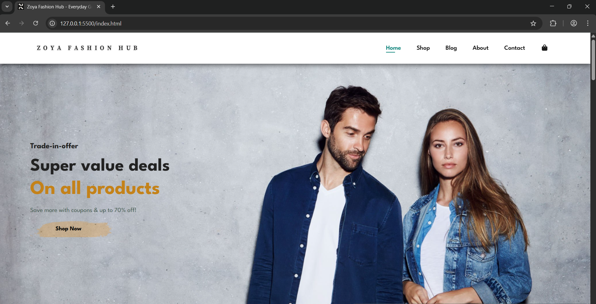
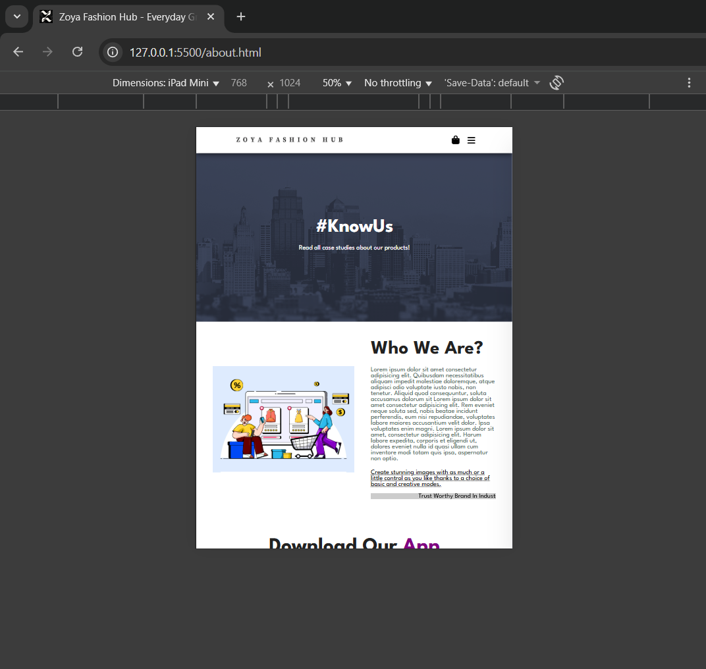
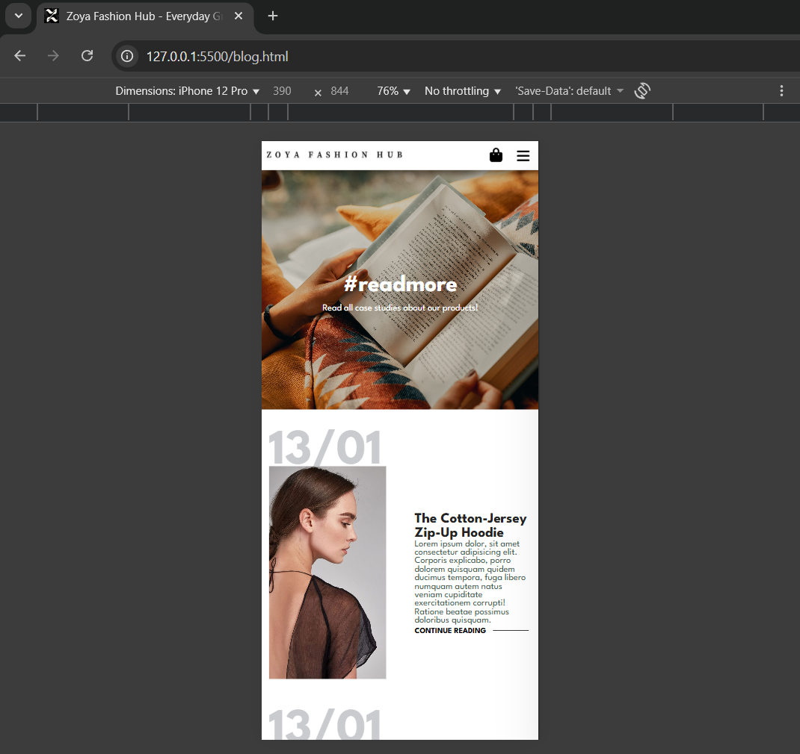

# Zoya Fashion Hub

A complete front-end for the Zoya Fashion Hub e-commerce website. Built using HTML, CSS, and vanilla JavaScript, it includes a Home page, Shop (with product pages), Blog, About, Contact, and a shopping Cart.

## 🚀 Live Demo

A live demo of this project is available at the link below:

**[https://zoya220.github.io/zoya-fashion-hub/](https://zoya220.github.io/zoya-fashion-hub/)**

## 📱 Responsive Design

This project is fully responsive and adapts to all device sizes, from mobile phones to desktops.

| Desktop | Tablet | Mobile |
| :---: | :---: | :---: |
|  |  |  |

---

## ✨ Features

* **Fully Responsive Design:** Adapts seamlessly to desktop, tablet, and mobile screens.
* **Complete Multi-Page Layout:** A consistent and complete user journey across 7 unique pages:
    * Home Page
    * Shop Page (Product Grid)
    * Single Product Page
    * Blog Page
    * About Page
    * Contact Page
    * Shopping Cart
* **Dynamic JavaScript Interactivity:**
    * Functional hamburger menu for mobile navigation.
    * Interactive product image gallery on the single product page.

---

## 💻 Technologies Used

* **HTML5:** For the core structure and content.
* **CSS3:** For all styling, layout (Flexbox), and responsiveness.
* **Vanilla JavaScript (ES6+):** For DOM manipulation and client-side interactivity.

---

## 🏃 How to Run Locally

This is a static front-end project. No installation or build steps are required.

1.  **Clone the repository:**
    ```bash
    git clone [https://github.com/zoya220/zoya-fashion-hub.git](https://github.com/zoya220/zoya-fashion-hub.git)
    ```
2.  **Navigate to the project folder:**
    ```bash
    cd zoya-fashion-hub
    ```
3.  **Open `index.html` in your web browser.**
    (You can do this by simply double-clicking the file.)
